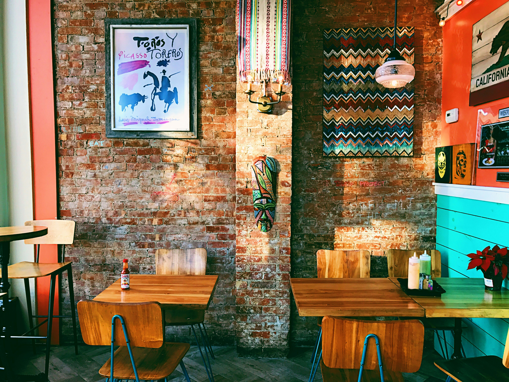
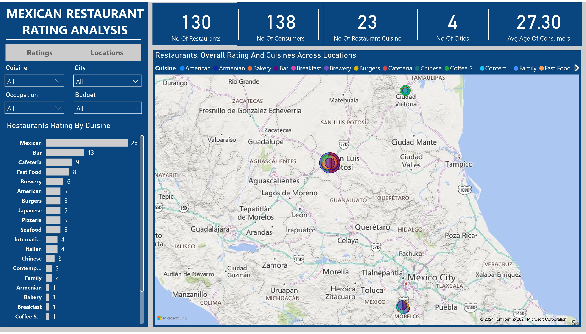

# Mexican Restaurant Rating Analysis

## Table of Contents
- [Project Overview](#project-overview)
- [About The Dataset](#about-the-dataset)
- [Tools Used](#tools-used)
- [Visualization in Power BI](#visualization-in-power-bi)
- [Project Analysis](#project-analysis)
- [Visuals in Power BI Report](#visuals-in-power-bi-report)
- [Recommendations on Demand and Supply Gaps, and Characteristics an Investor Should Look Out For When Investing in Restaurants](#recommendations-on-demand-and-supply-gaps,-and-characteristics-an-investor-should-look-out-for-when-investing-in-restaurants)

## Project Overview
### Introduction:
The Mexican Restaurant Rating Analysis project delves into the examination and evaluation of Mexican restaurant. Understanding historical trends and patterns in restaurant ratings can provide valuable insights into the evolution of consumer preferences, industry dynamics, and the factors driving success in the Mexican dining landscape during that period. This analysis illuminates restaurant ratings in Mexico by real consumers from 2012, including additional information about each restaurant and their cuisines, and each consumer and their preferences.

## Objectives:
The primary objectives of the Mexican Restaurant Rating (2012) Analysis project are:
- Analyze consumer ratings categorized by budget levels to discern patterns in satisfaction across different spending brackets.
- Determine the distribution of consumers across occupations to understand the demographic composition of restaurant patrons.
- Identify the distribution of restaurants across top 4 cities to assess geographical concentration and market saturation.
- Evaluate restaurant ratings segmented by price categories to understand the relationship between pricing and customer satisfaction.
- Assess restaurant ratings categorized by cuisine types to identify preferences and trends among diners.
- Determine the top 10 preferred cuisines among consumers to highlight popular culinary choices and inform menu planning strategies.
- Identify the top 10 restaurants based on ratings to recognize establishments with exceptional performance and quality.
- Analyze the number of consumers by marital status and occupation to gain insights into the characteristics and preferences of Mexican restaurant patrons.
- Analyze restaurant overall ratings and cuisine preferences across different locations to identify regional variations and market dynamics.

### Expected Outcomes:
- __Consumer Rating By Budget:__ Clear understanding of consumer satisfaction levels across different budget categories, enabling targeted adjustments to pricing and offerings.
- __Consumer Number By Occupation:__ Comprehensive insight into the demographic distribution of restaurant patrons by occupation, facilitating tailored marketing strategies and service enhancements.
- __Restaurant Number By City:__ Accurate identification of regional restaurant distribution patterns, informing strategic decisions regarding market presence and expansion.
- __Restaurant Rating By Price:__ In-depth understanding of how pricing influences consumer perceptions and satisfaction, guiding pricing strategies for enhanced customer experiences.
- __Restaurant Rating By Cuisine:__ Recognition of popular cuisines and their corresponding ratings, empowering restaurants to refine menus and offerings to align with consumer preferences.
- __Top 10 Preferred Cuisines By Consumers:__ Identification of prevailing culinary trends and preferences, informing menu development strategies and promotional campaigns.
- __Top 10 Restaurants By Rating:__ Recognition of top-performing establishments, providing benchmarks for excellence and inspiring improvement within the industry.
- __Consumers Bby Marital Status and Occupation:__ Detailed insights into the marital stauts and occupational statistics of restaurant-goers, facilitating targeted marketing initiatives and personalized customer experiences.
- __Restaurant Overall Rating and Cuisines Across Locations:__ Recognition of regional variations in restaurant performance and cuisine preferences, facilitating targeted strategies for different market segments and locations.

### About The Dataset
This dataset is made up of 6 tables which are the data_dictionary, consumer_preferences, restaurant_cuisines, ratings, restaurants, and the consumers table. This dataset was provided by [Quantum Analytics](https://www.quantumanalyticsco.org/). This is a [link](raw_data) to access the raw data folder, and in this folder are all the 6 tables. In this The data_dictionary table makes a description of all the fields in all the tables for a better understanding of them.

Below is a table that describes all the fields in all the tables in this dataset.

| Table                    | Field                    | Description                            |            
|:------------------------ |:------------------------ |:-------------------------------------- |
|Consumers                 | Consumer_ID              | Unique identifier for each consumer    |
|                          | City                     | City where the consumer lives          |
|                          | State                    | State where the consumer lives         |
|                          | Country                    | Country where the consumer lives         |
|                          | Latitude                    | Latitude where the consumer lives        |
|                          | Longitude                    |Longitude where the consumer lives        |
|                          | Smoker                     |Whether the consumer smokes or not         |
|                          | Drink_Level                 |Whether the consumer is an abstemious, causal, or social drinker |
|                          | Transportation_Method        |Whether the consumer transports on foot, by public transport, or by car |
|                          | Marital_Status            |The consumer's marital status (single or married) |
|                          |Children                 |Whether the consumer has dependent/independent children or kids |
|                          |Age                    |The consumer's age                      |
|                          |Occupation                   |The consumer's occupation (student, employed, or unemployed)            |
|                          |Budget                   |The consumer's budget (low, medium, high)         |
|Consumer_Preferences      |Preferred_Cuisine        |Types of food the consumer prefers        |
|Ratings                   |Overall_Rating           |The overall rating by the consumer for the restaurant (0=Unsatisfactory, 1=Satisfactory, 2=Highly Satisfactory)   |
|                          |Food_Rating              |The food's rating by the consumer for the restaurant (0=Unsatisfactory, 1=Satisfactory, 2=Highly Satisfactory)    |
|                          |Service_Rating           |The service rating by the consumer for the restaurant (0=Unsatisfactory, 1=Satisfactory, 2=Highly Satisfactory)    |
|Restaurants               |Restaurant_ID            |Unique identifier for each restaurant  |
|                          |Name                     |The restaurant's name |
|                          |City                     |The restaurant's city|
|                          |State                    |The restaurant's state |
|                          |Country                  |The restaurant's country|
|                          |Zip_Code                 |The restaurat's zip code|
|                          |Latitude                 |The restaurant's latitude|
|                          |Longitude                |The restaurant's longitude|
|                          |Alcohol_Service          |Whether the restaurant seves no alcohol, wine & beer, or a full bar|
|                          |Smoking_Allowed          |Whether any smoking is allowed, including in the bar or in smoking sections|
|                          |Price                    |The restaurant's price (low, medium, high)|
|                          |Franchise                |Whether the restaurant is a franchise|
|                          |Area                     |Whether the restaurant is in an open or closed area|
|                          |Parking                  |Whether the restaurant offers any sort of parking (none, yes, public, valet)|
|Restaurant_Cuisines       |Cuisines                 |Types of food the restaurant serves|

### Tools Used
1. Power Query Editor
    - Was used to:
        1. Extract,
        2. Transform, and
        3. Load all the datasets for this analysis.
           
2. Power BI (Was used to create reports and dashboard for this analysis)
    - The following Power BI Features were incorporated:
        1. DAX
        2. Quick Measures
        3. Page Navigation
        4. Filters
        5. Tooltips
        6. Button

### Data Cleaning, Transformation and Loading using the Power Query Editor:
1. Renamed the 2 columns in the __"consumer_preferences"__ table to the right names: __Consumer_ID__ and __Preferred_Cuisine__ and changed their data types to text.
2. Changed all data types of the fields in the __"consumers"__ table to the right data types.
3. Replaced the null cells in __Transportation_Method__, __Marital_Status__, __Budget__, and __Occupation__ fields of the __"consumers"__ table with "Not-Stated".
4. Replaced the null cells in __Children__ and __Smoker__ fields of the __"consumers"__ table with "Not-Known".
5. Changed the data types of the fields in the __"ratings"__ table to the right data types.
6. Added a new field __"Restaurant_Rating"__ to the __"ratings"__ table which extracts the data in the the __Overall_Rating__ Field and transforms them into _"Highly Satisfactory"_, _"Satisfactory"_, and _"Unsatisfactory"_.
7. Changed the data types of the 2 fields in the __"restaurant_cuisine"__ table to the right data types: _Restaurant_ID (int 64)_, _Cuisine (text)_.
8. Changed the data types of the fields in the __"restaurants"__ table to the right data types.

## Data Model Design
The data required for this analysis are located in various tables. Therefore, data modelling is required. A star Schema is designed with the __ratings__ table representing the fact table containing quantitative measures (ratings), and to which other dimension tables are modelled or connected to, using the __Customer_ID__  and __Restaurant_ID__ fields. 

The __ratings__ table has been modelled with:

- __consumers__ table using the __Consumer_ID__
- __restaurants__ table using the __Restaurant_ID__
- __consumer_preferences__ table using the __Consumer_ID__
- __restaurant_cuisines__ table using the __Restuarant_ID__

- The Model View displays a view of the __ratings__ (fact) table, the __consumers__ table (dimension),  __restaurants__ table (dimension),  the __consumer_preferences__ (dimension) table,  the __restaurant_cuisines__ (dimension) table, and the __Data Analysis Expression__ (DAX) standing alone.  You can access the full Power BI project document [here](https://github.com/Ugochukwuodinaka/Mexican-Restaurant-Rating-Analysis/blob/main/MEXICAN%20RESTAURANT%20RATING%20ANALYSIS.pbix).

Model View                                                                         |                                
:---------------------------------------------------------------------------------:|
                                             |        

## Visualization in Power BI:
#### Report 1

#### Report 2

### Project Analysis:
From the analysis, i made the following Key findings below:
- The Total Number of Restaurants is __130.__
- The Total Number of Consumers is __138.__
- The Number of Restaurant Cuisines is __23.__
- The Number of Restaurant Cities is __4.__
- The Average Age of Consumers is __27.5.__

- 
- **Consumer Rating By Budget:**
- In this analysis of consumer ratings by budget categories, notable trends were revealed in consumer satisfaction levels across different spending brackets. Among the identified budget categories - Low, Medium, High, and Not-Stated - consumers with a Medium budget represent the largest group, comprising 91 individuals (65.94% of the sample). Following are consumers with a Low budget (35 individuals, 25.36%), "Not-Stated" budget (7 individuals, 5.07%), and High budget (5 individuals, 3.62%).

- The distribution of ratings highlights the importance of catering to diverse budget segments. While Medium budget consumers dominate, the significant presence of Low budget and Not-Stated segments underscores the need to offer options catering to varied spending capacities. Tailoring pricing strategies and offerings to suit different budget categories can optimize customer satisfaction and retention. 

- 
- **Number of Consumers By Occupation:**
- In this analysis of consumer distribution by occupation, valuable insights into the demographic composition of restaurant patrons were provided, enabling tailored marketing strategies and service enhancements to meet the diverse needs of different occupational groups.
- Among the identified occupations - Students, Employed, Not-Stated, and Unemployed - students emerge as the dominant group, with 113 individuals constituting approximately 81.88% of the total sample. This highlights the significant presence of students within the customer base, indicating their importance as a key demographic for Mexican restaurants. 
- Following students are individuals categorized as Employed, comprising 16 consumers (11.59% of the sample). While smaller in number compared to students, the employed segment still represents a noteworthy portion of restaurant patrons. Recognizing their presence allows restaurants to develop offerings and experiences that cater to the needs and preferences of working professionals.
- The Not-Stated category, comprising 7 consumers (5.07%), presents an interesting demographic segment with undisclosed occupation information. Despite their smaller size, this group represents potential customers whose occupational status may vary or is not explicitly disclosed. 
- Lastly, the Unemployed group consists of 2 consumers, representing a smaller but still relevant portion of the sample (1.45%). A deep understanding of the needs and constraints of this demographic can guide restaurants in offering affordable options and value-driven promotions to accommodate their budgetary considerations.

- 
- **Number of Restaurants By City:**
- In this analysis of the analysis of the number of restaurants by city, insightful information is provided regarding the distribution of dining establishments across different locations. Among the identified cities - San Luis Potosi, Ciudad Victoria, Cuernavaca, and Juitepec - San Luis Potosi emerges as the city with the highest concentration of restaurants, boasting 84 establishments and commanding a significant percentage ratio of 64.62%. This indicates that San Luis Potosi is a bustling hub for dining and offers ample opportunities for restaurant businesses to thrive.
- Following San Luis Potosi is Ciudad Victoria, with 23 restaurants and a percentage ratio of 17.69%. While fewer in number compared to San Luis Potosi, Ciudad Victoria still represents a noteworthy market for restaurant expansion, offering potential growth opportunities and a diverse customer base to tap into.
- Cuernavaca, with 21 restaurants and a percentage ratio of 16.15%, ranks third in terms of restaurant concentration. Despite its slightly lower percentage ratio compared to Ciudad Victoria, Cuernavaca's vibrant dining scene suggests a favorable environment for restaurant businesses and warrants consideration for market presence and expansion initiatives.
- Lastly, Juitepec registers the lowest number of restaurants among the cities analyzed, with only 2 establishments and a percentage ratio of 1.54%. While relatively smaller in scale, Juitepec may still offer niche opportunities for restaurant ventures, particularly for those seeking to cater to a more specialized or underserved market segment.

- 
- **Restaurant Rating By Price:**
- In this analysis, restaurant ratings by price categories - Low, Medium, and High - provides valuable insights into the relationship between pricing and consumer perceptions, satisfaction, and ultimately, their dining experiences.
- Among the identified price categories, Medium-priced restaurants emerge as the dominant group, with 60 establishments and a percentage ratio of 40.15%. This suggests that a significant portion of consumers prefer dining at establishments offering moderate pricing. Medium-priced restaurants often strike a balance between affordability and quality, appealing to a wide range of consumers seeking value-driven dining experiences.
- Following Medium-priced restaurants are Low-priced establishments, comprising 45 restaurants and representing a percentage ratio of 34.62%. While slightly fewer in number compared to Medium-priced restaurants, Low-priced establishments cater to consumers seeking budget-friendly dining options. Despite the lower price point, these restaurants can still deliver satisfactory dining experiences, as evidenced by their considerable representation in the market.
- Lastly, High-priced restaurants rank lowest in terms of quantity, with 25 establishments and a percentage ratio of 19.23%. While fewer in number, High-priced restaurants cater to consumers willing to pay a premium for elevated dining experiences, often associated with higher quality ingredients, upscale ambiance, and exceptional service.

- 
- **Restaurant Rating By Price:**
- In this analysis of restaurant ratings by cuisine, valuable insights is provided into consumer preferences and the popularity of different culinary offerings. These preferences empowers restaurants to refine menus and offerings to align with consumer tastes, ultimately enhancing customer satisfaction and driving business success.
- Mexican Cuisine emerges as the top-ranking cuisine, with 28 restaurant offerings, indicating its widespread popularity among consumers. This underscores the significance of Mexican cuisine in the dining business, showing a strong demand for authentic Mexican flavors and dishes. 
- Following Mexican Cuisine are Bar, Cafeteria, and Fast Food, each with a substantial number of restaurant offerings. These cuisines appeal to different dining occasions and preferences, ranging from casual dining experiences at bars to quick and convenient options at fast-food establishments. 
Other notable cuisines include Brewery, American, Burgers, Japanese, Pizzeria, Seafood, International, and Italian, each with a respectable number of restaurant offerings. These cuisines represent a diverse array of culinary traditions and flavors, catering to a wide range of tastes and preferences among consumers. 
- Furthermore, the presence of lesser-known cuisines such as Armenian, Bakery, Coffee Shop, Game, Mediterranean, Regional, and Vietnamese highlights the growing diversity and experimentation within the restaurant industry. While these cuisines may have fewer offerings, they present good opportunities for restaurants to carve out unique identities and attract niche customer segments with specialized offerings.

- 
- **Top 10 Preferred Cuisines By Consumers:**
- In this analysis of the top 10 preferred cuisines by consumers, valuable insights is offered into prevailing culinary trends and the factors influencing consumer preferences in the dining landscape. 
- Mexican cuisine emerges as the clear favorite among consumers, with 97 individuals expressing a preference for its vibrant flavors and diverse dishes. This underscores the enduring popularity of Mexican cuisine, characterized by its bold spices, fresh ingredients, and rich culinary heritage. The widespread appeal of Mexican cuisine reflects a broader trend towards the appreciation of bold and flavorful foods that offer a sensory experience for diners.
- Following Mexican cuisine, American and Cafeteria cuisines rank prominently among consumers' preferences, with 11 and 9 individuals respectively expressing a preference for each. These cuisines evoke feelings of comfort and familiarity, offering classic dishes that resonate with a wide audience. The popularity of American cuisine reflects a nostalgic appeal for traditional favorites such as burgers, fries, and hearty comfort foods, while Cafeteria cuisine offers a diverse array of home-style dishes and comfort fare.
- Pizzeria and Coffee Shop cuisines also feature prominently in consumers' preferences, each with 9 and 8 individuals expressing a preference, respectively. Pizzerias appeal to consumers seeking convenient and satisfying meal options, with a variety of toppings and crust styles to suit different tastes. Meanwhile, Coffee Shops offer a cozy and inviting atmosphere, along with a selection of specialty coffees, pastries, and light bites, catering to consumers looking for a casual dining experience or a quick pick-me-up.
- Family, Italian, Japanese, Burgers, and Chinese cuisines round out the top 10 preferred cuisines, each reflecting distinct culinary traditions and flavors that resonate with consumers. Family-style restaurants offer a communal dining experience with generous portions and a focus on sharing, while Italian cuisine is celebrated for its comforting pasta dishes, flavorful sauces, and rustic flavors. Japanese cuisine emphasizes fresh ingredients, precise preparation techniques, and elegant presentation, appealing to consumers seeking a refined dining experience. Burgers and Chinese cuisines offer familiar and satisfying options that cater to a wide range of tastes and preferences.

- 
- **Top 10 Restaurants By Rating:**
- In this analysis of the top 10 restaurants by rating, i provided valuable insights into the establishments that have garnered the highest levels of customer satisfaction and acclaim. 
- Tortas Locas Hipocampo emerges as the top-ranked restaurant, boasting an impressive overall rating of 48. This accolade underscores the establishment's commitment to excellence in food quality, service, and overall dining experience. Tortas Locas Hipocampo's high rating suggests that it has successfully satisfied customers' expectations and consistently delivered exceptional dining experiences, earning it widespread acclaim and loyalty among patrons.
- Puesto De Tacon follows closely behind with a commendable overall rating of 41, indicating a strong performance in meeting customer expectations and delivering memorable dining experiences. The restaurant's success can be attributed to its focus on quality ingredients, authentic flavors, and attentive service, which have earned it a loyal customer base and positive word-of-mouth recommendations.
- Cafeteria Y Restaurant El Pacifico, La Cantina Restaurante, and Restaurant La Chalita round out the top five restaurants by overall rating, each with ratings of 33, 32, and 29, respectively. These establishments have distinguished themselves through their dedication to culinary excellence, hospitality, and customer satisfaction, earning them favorable reviews and repeat business from satisfied diners.
- Restaurante El Cielo Potosino, VIPs, El Rincon De San Francisco, Gorditas Doa Gloria, La Posada Del Virrey, Restaurant Oriental Express, and Restaurante Marisco Sam also merit recognition for their impressive overall ratings, each achieving a rating of 25. These restaurants have demonstrated a commitment to delivering memorable dining experiences characterized by delicious cuisine, attentive service, and inviting atmospheres, contributing to their positive reputation and success in the competitive restaurant industry.

- 
- **Number of Consumers By Marital Status and Occupation:**
- In this analysis of consumers by marital status and occupation, interesting patterns are revealed in consumer behavior, budget allocation, and cuisine preferences. 
- Single students emerge as the largest consumer segment, comprising 107 individuals. This group represents a significant portion of the consumer base, characterized by individuals who are likely to prioritize affordability, convenience, and variety in their dining choices. As students, they may have limited budgets and busy schedules, leading them to seek out budget-friendly dining options such as fast food, casual eateries, and ethnic cuisines that offer good value for money.
- Following single students are single employed consumers, with 13 individuals. This segment likely consists of young professionals who may have more disposable income than students but still value convenience and affordability in their dining choices. They may be willing to spend a bit more on dining experiences that offer quality, convenience, and variety, but still prioritize value for money in their dining decisions.
- Married students and married employed consumers represent smaller segments, with 6 and 3 individuals respectively. These consumers may exhibit similar preferences to their single counterparts but may also prioritize family-friendly dining options, comfort foods, and restaurants that offer a relaxed and welcoming atmosphere suitable for couples or families.
- The duo of married unemployed and single unemployed consumers each comprises 1 individual. While smaller in number, these segments may have distinct preferences and behaviors influenced by their employment status and marital status. They may be more budget-conscious and seek out affordable dining options or may be more inclined to cook meals at home to save money.

- 
- **Restaurants Overall Ratings and Cuisines Acrosss Locations:**
- The analysis of restaurants, overall ratings, and cuisines across locations provides valuable insights into the dining landscape, highlighting the distribution of dining establishments, their respective ratings, and the cuisines they offer. 
- Restaurants: The map showcases the geographical distribution of restaurants, providing an overview of where dining establishments are located within a specific region or area. Clusters of restaurants may indicate dining hubs or popular culinary destinations, while areas with fewer restaurants may present opportunities for expansion or investment in new dining concepts.
- Overall Ratings: Overlaying overall ratings onto the map allows us to identify areas with higher concentrations of highly-rated restaurants. High-rated restaurants may indicate areas known for their culinary excellence or dining experiences that consistently meet or exceed customer expectations. Conversely, areas with lower-rated restaurants may highlight opportunities for improvement or areas where there is room for new dining concepts to enter the market.
- Cuisines: The map also displays the distribution of cuisines offered by restaurants across locations. This allows us to identify culinary trends and preferences within different areas. For example, clusters of Mexican restaurants may indicate areas with a strong demand for Mexican cuisine, while the presence of diverse cuisines may suggest a more cosmopolitan dining scene.

## Visuals in Power BI Report:
You can view and interact with this dashboard report on Mexican Restuarant Rating Analysis [here](https://app.powerbi.com/view?r=eyJrIjoiYWVhNDM2NjItOTljOC00NjZiLTgyYzUtYWE0NTdhNzU3Yzk1IiwidCI6IjdlYzI5NjU5LTNjZjItNGYzZi1hYmIzLWE3MjJlZGY3ZmYyZCJ9).

## Recommendations on Demand and Supply Gaps, and Characteristics an Investor Should Look Out For When Investing in Restaurants:
__Recommendations on Demand & Supply Gaps:__
- Address Ethnic Cuisine Diversity: Identify gaps in Mexican cuisine representation and consider offering regional Mexican dishes or innovative twists on traditional favorites to meet consumer demand for authentic and diverse dining experiences.
- Cater to Budget-Conscious Consumers: Explore opportunities to provide affordable dining options without compromising quality, such as lunch specials, combo meals, or value menus, to attract price-sensitive customers and fill gaps in the market for budget-friendly Mexican cuisine.

__Characteristics an Investor Should Look Out For:__
- Strong Brand Identity: Invest in restaurants with a clear brand identity and unique selling proposition in the Mexican cuisine segment, demonstrating authenticity, quality, and a commitment to customer satisfaction.
- Operational Efficiency: Seek restaurants with efficient operations, streamlined processes, and experienced management teams capable of delivering consistent quality and service while maximizing profitability.
